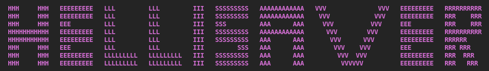

# Helli-Saver


A Simple Screen Saver For Linux.
# Description
Helli-Saver is a simple screen saver for Linux that does not let the screen be empty
# Setup
See [HelliWM](https://github.com/amirali511/HelliWM/) for more info.
# Installation or Uninstalling
Run `configure.sh` or
```bash
meson setup build;
ninja -C build;
sudo ninja -C build install;
```
# Run
Run it in a separate vt or in a desktop environment using:
```bash
# Desktop Env
hellisaver
# VT
startx hellisaver
```